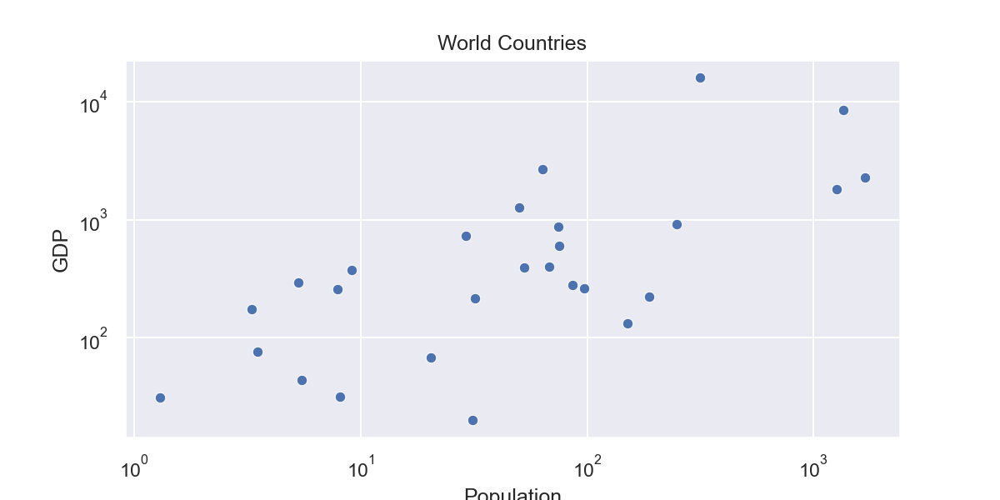

# Simple Torch

## Description
This project aims to help beginners learn PyTorch in an incremental fashion. For this we start with minimal examples and slowly expand out into more intermediate and advanced concepts.

### 1 Linear Regression

In this notebook, we study the relationship between a county's population size and economic size using Linear Regression.

## License
MIT License